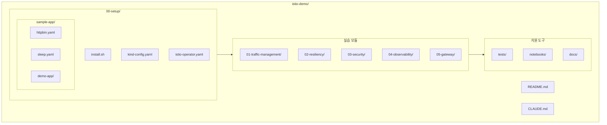
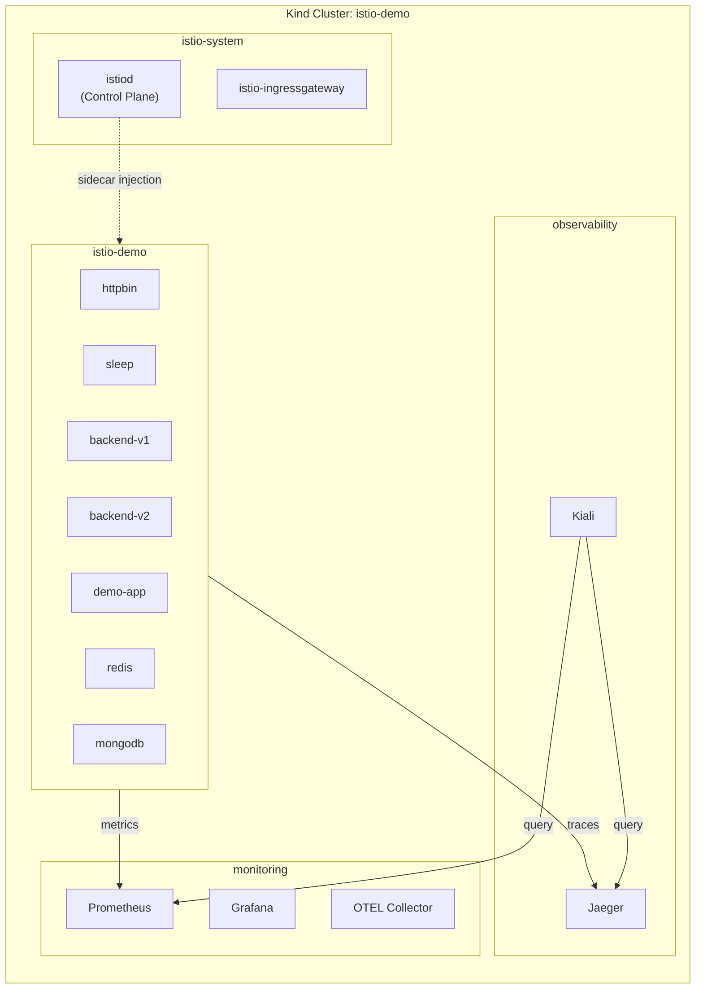
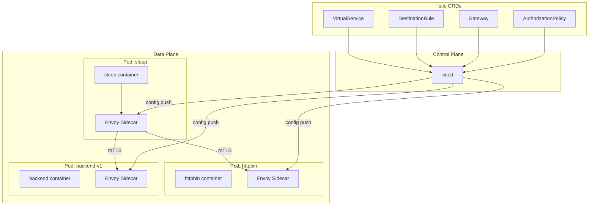
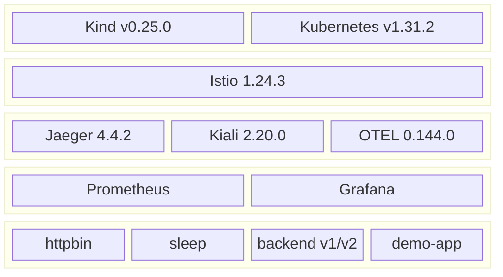
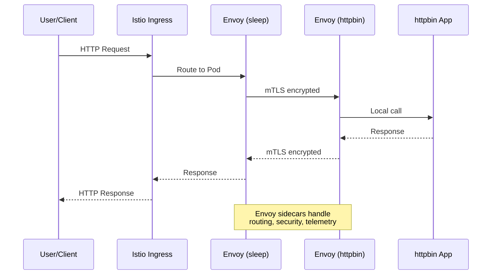

# Istio Demo Project Overview

## 프로젝트 구조

## Kubernetes 네임스페이스 구조

## Istio 아키텍처

## 실습 모듈 흐름

```mermaid
flowchart LR
    subgraph M0["Module 0<br/>Setup"]
        m0a["Kind 클러스터"]
        m0b["Istio 설치"]
        m0c["샘플 앱 배포"]
    end

    subgraph M4["Module 4<br/>Observability"]
        m4a["Kiali"]
        m4b["Jaeger"]
        m4c["Grafana"]
    end

    subgraph M1["Module 1<br/>Traffic"]
        m1a["Canary 배포"]
        m1b["헤더 라우팅"]
        m1c["트래픽 미러링"]
    end

    subgraph M2["Module 2<br/>Resiliency"]
        m2a["Timeout"]
        m2b["Retry"]
        m2c["Circuit Breaker"]
    end

    subgraph M3["Module 3<br/>Security"]
        m3a["deny-all"]
        m3b["allow 정책"]
        m3c["path 기반"]
    end

    subgraph M5["Module 5<br/>Gateway API"]
        m5a["Gateway"]
        m5b["HTTPRoute"]
    end

    M0 --> M4 --> M1 --> M2 --> M3 --> M5
```

## 컴포넌트 스택

## 트래픽 흐름

## 주요 포트 매핑

| 서비스 | 내부 포트 | 외부 포트 | 용도 |
|--------|-----------|-----------|------|
| Kiali | 20001 | 20001 | Service Mesh 시각화 |
| Jaeger | 16686 | 16686 | 분산 트레이싱 UI |
| Grafana | 80 | 3000 | 메트릭 대시보드 |
| Prometheus | 9090 | 9090 | 메트릭 쿼리 |
| Ingress | 80 | 31080 | 외부 트래픽 진입점 |

## 파일 구조 요약

| 디렉토리 | 파일 유형 | 설명 |
|----------|-----------|------|
| `00-setup/` | YAML, Shell | 클러스터 및 Istio 설치 |
| `01-traffic-management/` | YAML | VirtualService, DestinationRule |
| `02-resiliency/` | YAML | Timeout, Retry, Circuit Breaker |
| `03-security/` | YAML | AuthorizationPolicy |
| `04-observability/` | YAML | Gateway 설정 (UI 접근용) |
| `05-gateway/` | YAML | Gateway API 리소스 |
| `tests/` | Shell | 각 모듈별 검증 스크립트 |
| `notebooks/` | ipynb | 한국어 실습 가이드 |
